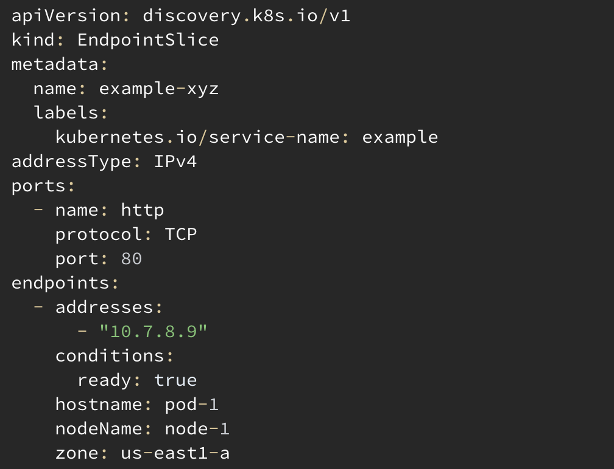

:::tip Before you start
Prepare your environment for this section:
 
```bash wait=30 timeout=600
 $ prepare-environment networking/traffic-distribution
```

This will make the following changes to your lab environment:
 
- Create three replicas of the UI and catalog services, distributed evenly across three distinct Availability Zones
- Install OpenTelemetry operator, collector and instrumentation objects  
- Configure required IAM Role for OpenTelemetry 

You can view the Terraform that applies these changes [here](https://github.com/VAR::MANIFESTS_OWNER/VAR::MANIFESTS_REPOSITORY/tree/VAR::MANIFESTS_REF/manifests/modules/networking/vpc-lattice/.workshop/terraform)
:::


Previously when you create a Service Kubernetes would create an Endpoint object which stored information of all the IP addresses of the pods matching the Service’s selector.

Since [v1.1.9](https://kubernetes.io/blog/2020/09/02/scaling-kubernetes-networking-with-endpointslices/) Kubernetes replaced the Endpoints object with the EndpointSlices object. While the Endpoint object contained IP address and ports of pods backing a Service, the EndpointSlices object extends pod information by adding topology information including zone (AZ). 
Before Traffic Distribution when traffic got sent to a Service (via it’s Cluster IP) it would get routed to one of the pods matching the Service’s selector using the load balancing algorithm of the iptables or IP Virtual Server (IPVS) running on the node as set by kube-proxy, this routing doesn’t take into consideration the zone of the originating traffic as this isn’t available in the Endpoint object.

In [v1.33](https://kubernetes.io/blog/2025/04/23/kubernetes-v1-33-release/#topology-aware-routing-with-trafficdistribution-preferclose) Traffic Distribution and another feature: Topology-Aware Routing became Generally Available (GA). Both Traffic Distribution and Topology-Aware Routing are similar features that aim to prioritize same-zone traffic.

The difference between both features is that Topology-Aware Routing attempts to distribute traffic across the zones proportionally based on available CPU resources, while Traffic Distribution takes a more predictable and simpler approach by considering all endpoints in the zone ("If there are endpoints in the zone, they will receive all traffic for that zone, if there are no endpoints in a zone, the traffic will be distributed to other zones"). 
The annotation for Topology-Aware Routing may also be deprecated in favor of the Traffic Distribution field in the future. 

When Traffic Distribution is configured kube-proxy running on the node will consult the EndpointSlices object for zone information of the pods that it can route to and will apply rules on the node to route traffic to pods in the same AZ as the source.

Below is an example of an EndpointSlices object with the zone information included.


