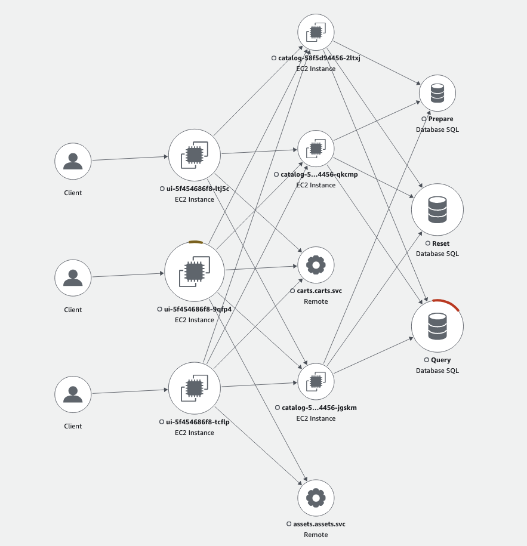

In this lab we are going to confirm the default traffic routing setup for the sample application with a focus on routing between the UI and Catalog components through a Service.

Currently there are 3 nodes deployed across the 3 different AZs, you can confirm that with the below command: 


```bash
$ kubectl get node -ocustom-columns="Name:.metadata.name,Zone:.metadata.labels.topology\.kubernetes\.io/zone"
Name                                          Zone
ip-10-42-117-145.eu-west-1.compute.internal   eu-west-1a
ip-10-42-141-139.eu-west-1.compute.internal   eu-west-1b
ip-10-42-181-156.eu-west-1.compute.internal   eu-west-1c
```

Preparing the environment at the start will have scaled UI and Catalog components to three replicas each. Let’s verify we see 3 pods for both components of the application with each pod running on a node in each of the 3 AZs:


```bash
$ kubectl get pods -n ui -o wide && kubectl get pods -n catalog -o wide
NAME                  READY   STATUS    RESTARTS        AGE   IP              NODE                                          NOMINATED NODE   READINESS GATES
ui-5f454686f8-9qfp4   1/1     Running   1 (4d16h ago)   72d   10.42.124.229   ip-10-42-117-145.eu-west-1.compute.internal   <none>           <none>
ui-5f454686f8-ltj5c   1/1     Running   1 (4d16h ago)   72d   10.42.150.160   ip-10-42-141-139.eu-west-1.compute.internal   <none>           <none>
ui-5f454686f8-tcflp   1/1     Running   1 (4d16h ago)   72d   10.42.185.85    ip-10-42-181-156.eu-west-1.compute.internal   <none>           <none>
NAME                       READY   STATUS    RESTARTS        AGE   IP              NODE                                          NOMINATED NODE   READINESS GATES
catalog-58f5d94456-2ltxj   1/1     Running   3 (4d16h ago)   72d   10.42.116.225   ip-10-42-117-145.eu-west-1.compute.internal   <none>           <none>
catalog-58f5d94456-jgskm   1/1     Running   3 (4d16h ago)   72d   10.42.150.167   ip-10-42-141-139.eu-west-1.compute.internal   <none>           <none>
catalog-58f5d94456-qkcmp   1/1     Running   3 (4d16h ago)   72d   10.42.185.86    ip-10-42-181-156.eu-west-1.compute.internal   <none>           <none>
```

For this lab, we use observability tools (OpenTelemetry and AWS X-Ray) to help us visualize the behavior of Traffic Distribution.

As part of the preparation of the Lab environment which we ran previously there were different [AWS Distro for Open Telemetry(ADOT)](https://aws.amazon.com/otel/) components that got deployed in the EKS Cluster that will collect traces from UI and Catalog components and export it to AWS X-Ray to allow us visualize the traffic flow. 

Let’s confirm that they are running:

[OpenTelemetry Operator](https://github.com/open-telemetry/opentelemetry-operator)

```bash
$ kubectl -n opentelemetry-operator-system get pods
NAME                                                    READY   STATUS    RESTARTS        AGE
opentelemetry-opentelemetry-operator-6c56d74b78-qkvtt   2/2     Running   2 (4d16h ago)   78d
```

The OpenTelemetry operator manages:

- [OpenTelemetry Collector](https://github.com/open-telemetry/opentelemetry-collector)
- [Auto-instrumentation](https://opentelemetry.io/docs/concepts/instrumentation/automatic/) of the workloads using OpenTelemetry instrumentation libraries

OpenTelemetry Collector

```bash
$ kubectl get opentelemetrycollector -n other
NAME   MODE         VERSION   READY   AGE   IMAGE                                                         MANAGEMENT
adot   deployment   0.104.0   1/1     72d   public.ecr.aws/aws-observability/aws-otel-collector:v0.40.0   managed
```


Now that we have 3 pods each of the UI and Catalog component we will generate a load test to simulate traffic between them to see how traffic is routed. We’d use the [hey](https://github.com/rakyll/hey) program to generate HTTP Requests traffic to UI’s load balancer by running the below command:


```bash
$ export UI_ENDPOINT=$(kubectl get service -n ui ui-nlb -o jsonpath="{.status.loadBalancer.ingress[*].hostname}{'\n'}")
$ kubectl run load-generator \
--image=williamyeh/hey:latest \
--restart=Never -- -c 10 -q 5 -z 60m http://$UI_ENDPOINT/home
```


Once this is done navigate to the X-Ray console where you’d find a visual Trace Map of the traffic flow from client to ui to catalog: 

<ConsoleButton url="https://console.aws.amazon.com/xray/home" service="xray" label="Open X-Ray console"/>


You’d notice from the Trace map that traffic from each of the UI pods is sent to each of the 3 Catalog pods in all 3 AZs.



